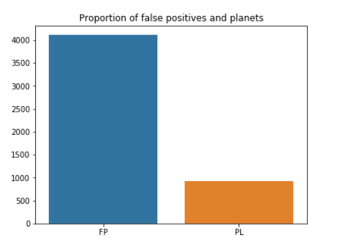
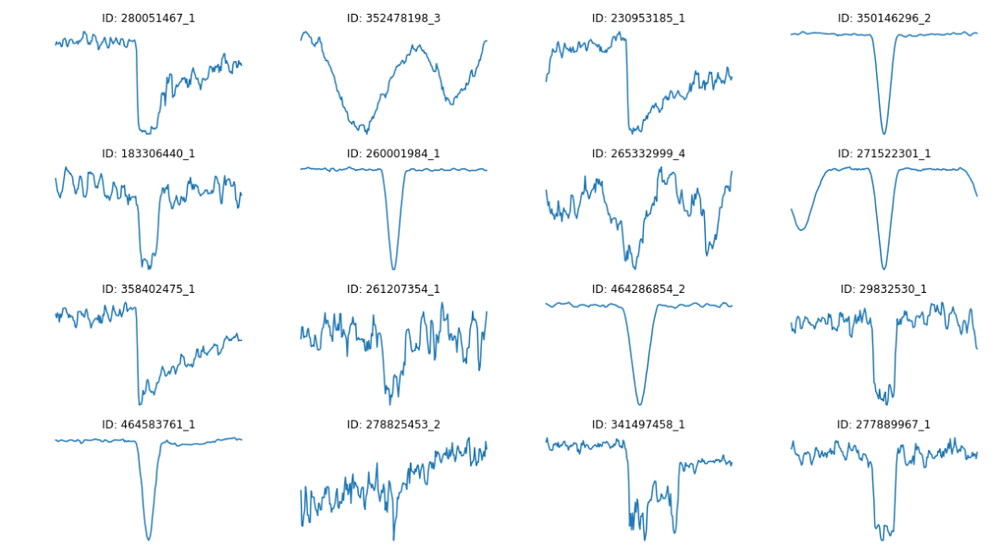
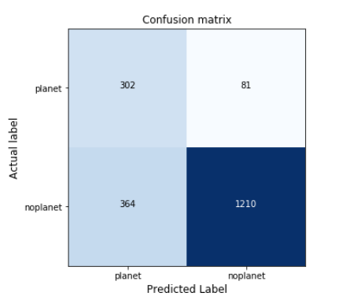
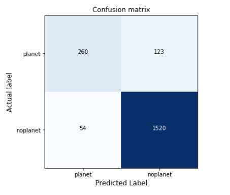
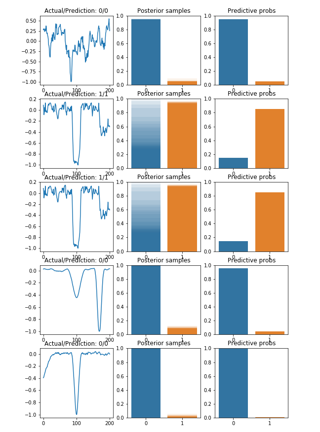
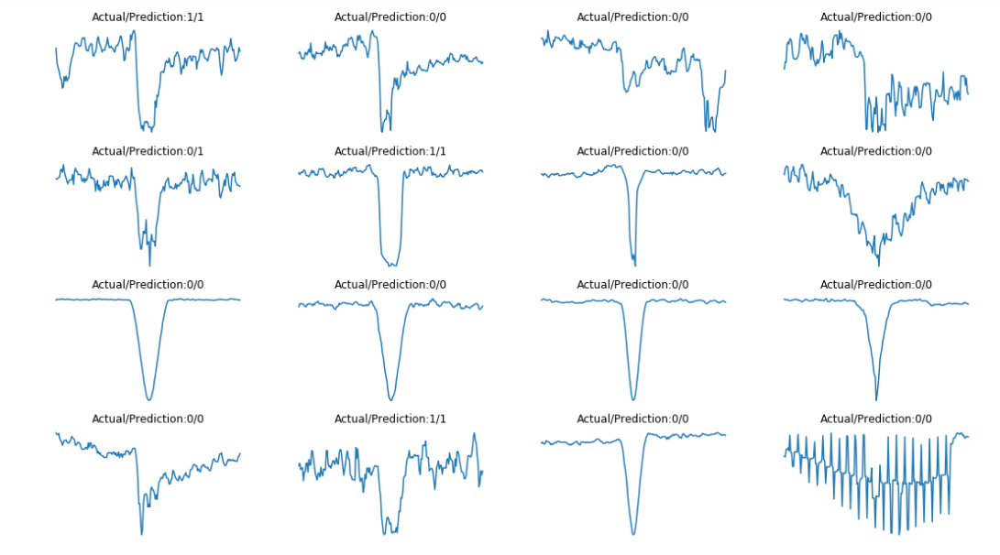

# NASA Frontier Development Lab - Exoplanets Challenge

## NASA Frontier Development Lab

The NASA Frontier Development Lab (FDL) is an applied artificial intelligence (AI) research accelerator, hosted by the SETI Institute in partnership with NASA Ames Research Centre. The programme brings commercial and private partners together with researchers to solve challenges in the space science community using new AI technologies.

NASA FDL 2018 focused on four areas of research - Space Resources, Exoplanets, Space Weather and Astrobiology - each with their own separate challenges. This paper will focus on the Exoplanets challenge, which aimed to improve accuracy in finding new exoplanets.


## The TESS Mission

The Transiting Exoplanet Survey Satellite (TESS) was launched in April 2018, with the objective of discovering new exoplanets in orbit around the brightest stars in the solar neighborhood.

For the two year mission, the sky was segmented into 26 sectors, each of which will be the focus of investigation for 27 days. TESS will spend the first year exploring the 13 sectors that cover the Southern Hemisphere, before rotating to explore the Northern Hemisphere during year two.

Pictures will be taken, at a given frequency, to create a Satellite Image Time Series (SITS) for each sector.  Once collected, SITS are passed through a highly complex data-processing pipeline, developed by NASA. During the first stage, calibration finds the optimal set of pixels representing each target star. Aggregate brightness is extracted from the sequence and the pixels associated with each star, to create a light curve (time series) for each target star. The raw light curve is processed to remove: noise, trends and other factors introduced by the satellite itself. The final result is the corrected flux from the star, referred to from now on as a light curve.

Light curves are the subject of study when attempting to detect exoplanets. Variations in brightness of the target stars may indicate the presence of a transiting planet. The preprocessing pipeline searches for signals consistent with transiting planets, in order to identify planet candidates or Threshold Crossing Events (TCEs). However, the list of TCEs will likely contain a large number of false positives, caused by eclipsing binary systems, background eclipsing binaries or simple noise.

At this stage, machine learning (ML) comes into play. In this paper we propose a Bayesian Neural Network to try and classify the extracted TCEs as real planets or false positives. We will take advantage of the strength of kdb+/q to deal with time-series data and embedPy to import the necessary python ML libraries.


The technical dependencies required for the below work are as follows:

 - embedPy
 - pydl 0.6.0
 - scipy 0.19.1
 - scikit-learn 0.19.1
 - matplotlib 2.1.0
 - numpy 1.14.5
 - seaborn 0.8
 - tensorflow-probability 0.3.0
 - tensorflow 1.12.0 
 
## Data
 
 TESS had yet to produce data during FDL 2018, so data from 4 different sectors was simulated by NASA. 16,000 stars were generated for each sector and planets were placed around some stars following well known planet models. Eclipsing binaries and background eclipsing binaries were also injected into the simulation, and noise was added to the data.

The generated data was given to the pipeline to extract the 64,000 light curves and identify TCEs. Strong signals were found in 9,139 light curves, which were passed to the data validation stage for further analysis. The light curve for each TCE was reprocessed to look for multiple signals in the same curve and allow identification of multiplanetary systems. The result was a total of 19,577 planet candidates identified over 9,139 stars.

The data validation stage also found optimal parameters (epoch, period, duration) relating to each potential transit. These parameters describe how to “fold” the light curves in order to create a local view of the transits to emphasize the signal and cancel any noise.

An advantage of dealing with simulated data, is that we have the ground truth regarding exactly how many planets were injected into each star.

In order to classify TCEs as either real planets or false positives, we consider the following data:

 1. **Ground truth**: data about the injected signals (i.e. real planet or false positive).
 2. **Data validation data**: information about the TCEs found in the data validation stage.
 3. **Light curves**: fits files containing the light curve of each star.

## Feature Engineering

The TCEs are spread across 4 different sectors, each of which is processed separately during the first stages. Once a local view is created for each light curve, these are merged to form a single dataset which is used by the Bayesian neural network for training and testing.

### TCE Information

The following table gathers all required information provided by the validation process about the TCEs found in sector 1 as well as their labels:

```q
5#tces:("SJIIFFFI";(),csv)0:`:../../data/sector1/tces/tceinfo.csv   

tceid       catid     n_planets tce_num tce_period tce_time0bk tce_duration planet
----------------------------------------------------------------------------------
6471862_1   6471862   1         1       7.788748   1315.736    1.993841     1     
6528628_1   6528628   2         1       2.031586   1312.364    3.604171     0     
6528628_2   6528628   2         2       2.031944   1311.081    3.5          0     
61088106_1  61088106  1         1       17.95108   1316.481    12.03493     0     
314197710_1 314197710 1         1       19.29932   1318.371    8.749369     0    
```

Each TCE is identified by its id (*tceid*), which combines the star where it was found (*catid*) and the number that identifies the TCE (*tce_num*) in the set of TCEs (*n_planets*) detected in the star. Column planet indicates the label of the TCE, which takes value 1 (positive class) if the TCE represents a real planet and 0 (negative class) otherwise. Finally, period, epoch and duration are used to fold the light curve.

When dealing with a classification problem, an important aspect of the dataset is the distribution of classes in the data. It was introduced before that many false positives are detected in the data validation stage, moreover, the number of provided false positives is much larger than the number of planets, which gives a quite unbalanced dataset as we can see by looking at the label distribution:

```q
show dis:select n:count i by planet from tces

planet| n   
------| ----
0     | 4109
1     | 919

sns:.p.import`seaborn
plt:.p.import`matplotlib.pyplot
sns[`:barplot][`FP`PL;exec n from dis][`:set_title]"Proportion of false positives and planets";
plt[`:show][];
```

  
<small>_Figure 1: Label distribution._</small>

Less than 20% of the TCEs are actually planets (a similar distribution is found in sectors 2, 3 and 4),  a fact that should be considered later when preparing the data to train the classifier.

Before looking at the light curves, we will split the TCEs into training and test sets. To monitor training and inform hyper-parameter tuning, we will also include a validation set.

```q
show tcessplit:`trn`val`tst!(0,"j"$.8 .9*numtces)_neg[numtces:count tces]?tces
  
trn| +`tceid`catid`n_planets`tce_num`tce_period`tce_time0bk`tce_duration`plan..
val| +`tceid`catid`n_planets`tce_num`tce_period`tce_time0bk`tce_duration`plan..
tst| +`tceid`catid`n_planets`tce_num`tce_period`tce_time0bk`tce_duration`plan..
```

### Local View Extraction

The local view associated with each TCE can be extracted from the light curve using the *period, epoch* and *duration*.

```q
tsopdir:`:/home/nasafdl/data/tsop301/sector1
\l ../utils/extractlocal.q

trnpro:processtce[tsopdir]each trnlabels:tcessplit`trn
trndata:flip(`$string tcessplit[`trn]`catid)!trnpro@\:`local

valpro:processtce[tsopdir]each vallabels:tcessplit`val
valdata:flip(`$string tcessplit[`val]`catid)!valpro@\:`local


tsopdir:`:/home/nasafdl/data/tsop301/sector1
\l ../utils/extractlocal.q

trnpro:processtce[tsopdir]each trnlabels:tcessplit`trn
trndata:flip(`$string tcessplit[`trn]`catid)!trnpro@\:`local

valpro:processtce[tsopdir]each vallabels:tcessplit`val
valdata:flip(`$string tcessplit[`val]`catid)!valpro@\:`local

tstpro:processtce[tsopdir]each tstlabels:tcessplit`tst
tstdata:flip(`$string tcessplit[`tst]`catid)!tstpro@\:`local


5#trndata

280051467_1 352480413_1 456593119_1 358510596_1  183642345_2 261657455_1 2653..
-----------------------------------------------------------------------------..
0.2771269   0.2590945   0.08329642  -0.005732315 0.2286466   0.01266482  0.02..
0.3392213   0.4783      0.08432672  -0.001671889 0.2198233   0.1922276   0.02..
0.2883021   0.2146166   0.08432672  0.002503958  0.2176699   0.3185288   0.03..
0.2873107   0.2509516   0.09310736  0.006680667  0.2189751   0.3078591   0.03..
0.2997477   0.3955775   0.09130886  0.006680667  0.2031908   0.1432165   0.03..


5#trnlabels

tceid       catid     n_planets tce_num tce_period tce_time0bk tce_duration planet
----------------------------------------------------------------------------------
280051467_1 280051467 1         1       15.15262   1312.372    0.2404994    0     
352480413_1 352480413 1         1       18.84509   1311.424    0.5792979    1     
456593119_1 456593119 1         1       4.565184   1313.697    0.2467387    0     
358510596_1 358510596 1         1       3.800774   1312.677    0.09960142   0     
183642345_2 183642345 2         2       7.013778   1311.829    0.2995369    0  

```

Since there is overlapping between sectors, we prepend the sector number to the column name to uniquely identify each TCE:

```q

addsect:{(`$"_" sv/: string y,'cols x)xcol x}
5#trndata:addsect[trndata;`1]

1_280051467_1 1_352480413_1 1_456593119_1 1_358510596_1 1_183642345_2 1_26165..
-----------------------------------------------------------------------------..
0.2771269     0.2590945     0.08329642    -0.005732315  0.2286466     0.01266..
0.3392213     0.4783        0.08432672    -0.001671889  0.2198233     0.19222..
0.2883021     0.2146166     0.08432672    0.002503958   0.2176699     0.31852..
0.2873107     0.2509516     0.09310736    0.006680667   0.2189751     0.30785..
0.2997477     0.3955775     0.09130886    0.006680667   0.2031908     0.14321..
```
To get a better understanding of what light curves are like, we can plot a random selection using matplotlib via embedPy:

```q

sample:16?update tce_duration%24 from tces

plt:.p.import`matplotlib.pyplot
subplots:plt[`:subplots][4;4]
fig:subplots[@;0]
axarr:subplots[@;1]
fig[`:set_size_inches;18.5;10.5];
{[i]
  j:cross[til 4;til 4]i;
  box:axarr[@;j 0][@;j 1];
  box[`:plot]r[i]`local;
  box[`:axis]`off;
  box[`:set_title]"ID: ",string sample[i]`catid;
 }each til 16;
plt[`:show][];
```

  
<small>_Figure 2: Local view of some random TCEs._</small>

Several types of curves with distinct behaviours and dips are shown in the plot. Now, the objective is to find patterns that characterize the drops in brightness caused by real planets.

### Data Preparation

Having performed the previous steps for each sector, we combine the data to create training, validation and test sets containing data from all four sectors:

* **Training data**:

```q
count cols trndata
15662

select n:count i by planet from trnlabels
planet| n    
------| -----
0     | 12560
1     | 3102
```

* **Validation data**:
```q
count cols valdata
1958

select n:count i by planet from vallabels
planet| n   
------| ----
0     | 1558
1     | 400
```

* **Test data**:
```q
count cols tstdata
1957

select n:count i by planet from tstlabels
planet| n   
------| ----
0     | 1574
1     | 383
```

We flip the data and drop column names, to create a matrix where each row represents a unique TCEs. We also extract the labels as vectors:

```q
xtrain:value flip trndata
ytrain:trnlabels`planet

xval:value flip valdata
yval:vallabels`planet

xtest:value flip tstdata
ytest:tstlabels`planet
```

Training, validation and test sets fairly reproduce the proportion of planets in the whole dataset, where 20\% of the TCEs are actually planets. This ratio could be an issue when training a model, since planets would have low importance in the gradient when updating the network weights. To mitigate this problem, we oversample the positive class. We add a random sample of planets to the training set, so that the final proportion of planets vs non-planets will be 50\%-50\%. Now, we can create the final balanced training set easier:

```q
show p0:avg ytrain
0.198059

/ Final proportion of planets vs non planets
p1:0.5

sample:(nadd:(-) . sum each ytrain=/:(0 1))?xtrain where ytrain

xoversampled:xtrain,sample
yoversampled:ytrain,nadd#1

ind:neg[n]?til n:count yoversampled
finalxtrain:xoversampled ind
finalytrain:yoversampled ind

count finalytrain
25120
```

## Benchmark model

Our objective is to train a Bayesian neural network to identify dips in the light curves caused by planets. However, it is important to have a benchmark model that allows us to compare performance and better interpret results obtained by more complex models. 

### Model

The model chosen as a benchmark is a linear classifier, which considers a linear combination of the features to make the predictions. The model tries to linearly separate classes and bases its decisions on that. 

SGDClassifier is imported from sklearn using embedPy and trained on the training dataset in order to find the weights of the linear combination that better separate classes:

```q
sgd:.p.import[`sklearn.linear_model][`:SGDClassifier][]
sgd[`:fit][finalxtrain;finalytrain];
```
We do not optimize the parameters, so the validation set as well as the test set are used to test the performance of the model.


### Predictions

#### Validation set

Predictions can be easily obtained once the model is trained by only calling the predict method:

```q
show valpreds:sgd[`:predict;xval]`
0 0 0 0 0 0 0 1 0 1 0 0 0 0 0 1 1 0 0 0 0 0 0 0 1 1 0 1 0 0 1 1 0 1 1 0 1 1 1..
```
Accuracy is usually computed to test performance of a model, however, this is not always a good measure of the performance of the model, especially when dealing with unbalanced datasets due to a classifier always predicting the majority class would achieve a high accuracy too. Precision and recall are better choices in these cases since they allow to differentiate between models that prioritize false positives over false negatives and to make a decision about the best model based on the objective of the particular problem. The confusion matrix is also very useful because results can be better visualized:


```q
\l ../utils/functions.q

accuracy[yval;valpreds]
0.7793667
precision[1;yval;valpreds]
0.4766082
sensitivity[1;yval;valpreds]
0.815

cm:confmat[1;yval;valpreds]
displayCM[value cm;`planet`noplanet;"Confusion matrix";()]
```
  
<small>_Figure 3: Confusion matrix of the benchamark model with the validation set._</small>

The linear classifier is able to detect a high proportion of planets (75\%), however, the precision of the model is low. We would like to maximize this. 

#### Test set

Results are also obtained using the test set, which will also allow us to compare results afterwards:

```q
show testpreds:sgd[`:predict;xtest]`
1 1 0 0 0 0 1 0 0 1 0 0 1 1 0 0 1 0 0 0 0 0 0 1 0 0 0 1 0 0 0 0 1 0 0 1 0 0 1..

accuracy[ytest;testpreds]
0.7726111
precision[1;ytest;testpreds]
0.4534535
sensitivity[1;ytest;testpreds]
0.7885117

cm:confmat[1;ytest;testpreds]
displayCM[value cm;`planet`noplanet;"BNN confusion matrix";()]
```
  
<small>_Figure 1: Confusion matrix of the benchamark model with the test set._</small>

Results are similar to those obtained on the validation set.

## Bayesian Neural Network Model

### Model

Machine learning models usually depend on several parameters that need to be optimized to achieve the best performance. Bayesian Neural Networks are no exception to this. Learning rate, number of epochs, batch size, number of montecarlo samples, activation function or architecture highly condition results. Values for these parameters are defined in a dictionary and will be used to build and train the neural network:


```q
paramdict:`lr`mxstep`layersize`activation`batchsize`nmontecarlo`trainsize!(0.01;10000;128 128;`relu;512;500;count finalytrain)

paramdict

lr         | 0.01
mxstep     | 10000
layersize  | 128 128
activation | `relu
batchsize  | 512
nmontecarlo| 500
trainsize  | 25120
```

Before training the model, we need to split the data into batches. In order to do that, we create two functions:

* *buildtraining*: splits training dataset into batches of specified size and creates an iterator that allows the neural network to train on all the batches when learning.
* *builditerator*: creates an iterator of size 1, which captures the whole set. 

```q
tf:.p.import`tensorflow
np:.p.import[`numpy]
array:np[`:array]
pylist:.p.import[`builtins]`:list
tuple:.p.import[`builtins]`:tuple

buildtraining:{[x;y;size]       
 dataset:tf[`:data.Dataset.from_tensor_slices]tuple(np[`:float32;x]`.;np[`:int32;y]`.);
 batches:dataset[`:repeat][][`:batch]size;
 iterator:batches[`:make_one_shot_iterator][];
 handle:tf[`:placeholder][tf`:string;`shape pykw()];
 feedable:tf[`:data.Iterator.from_string_handle][handle;batches`:output_types;
            batches`:output_shapes];
 data:feedable[`:get_next][][@;]each 0 1;
 `local`labels`handle`iterator!{x`.}each raze(data;handle;iterator)
 }

builditerator:{[x;y;size]
 dataset:tf[`:data.Dataset.from_tensor_slices]tuple(np[`:float32;x]`.;np[`:int32;y]`.);
 frozen:dataset[`:take][size][`:repeat][][`:batch]size;
 frozen[`:make_one_shot_iterator][]
 }
```

An iterator with batches of size 512 is created using the training set while validation and test sets are converted to iterators of size 1 so they are represented in the same way as the training set and can be passed to the neural network and obtain predictions.

```q
traindict:buildtraining[finalxtrain;finalytrain;paramdict`batchsize]
iterators:`val`test!{x`.}each builditerator ./:((xval;yval;count yval);(xtest;ytest;count ytest))
```

Finally, we can pass this data to the python process running in q and load the script that contains the model and the code to train it:

```q
{.p.set[x]get x}each`paramdict`traindict`iterators;
\l ../utils/bnn.p
```

### Predictions

Predictions of the TCEs in the validation and test sets will be based on montecarlo samples of size 500 created by the trained Bayesian neural network. The model produces a probability of each TCE being of class 0 (non planet) or class 1 (planet).

Probabilities are distorted since the network was trained on an oversampled dataset and they need to be corrected. After doing this, the predicted class is the one that gives larger average probability.
Validation set


#### Validation set

To obtain the montecarlo sample for each TCE in the validation set, the validation iterator created before needs to be passed to the neural network 500 times:


```q
p)val_handle = sess.run(iterators['val'].string_handle())
p)probs=[sess.run((labels_distribution.probs),feed_dict={handle:val_handle}) for _ in range(paramdict['nmontecarlo'])]
valprobs:`float$.p.get[`probs]`
```

Variable *valprobs* contains the montecarlo sample of the probabilities provided by the Bayesian neural network. We correct these probabilities for the oversampling, creating the right distribution of the data.


```q
corprobs:{[p0;p1;p]
 1%1+(((1%p0)-1)%(1%p1)-1)*(1%p)-1
 }

corvalprobs:{[p0;p1;p;i].[p;(::;::;i);corprobs . $[i=0;(1-p0;1-p1);(p0;p1)]]}[p0;p1]/[valprobs;0 1]
```

Once corrected probabilities have been recovered, we compute the mean of the probabilities of each class and predict the instances as the class associated with the maximum mean probability:

```q
show valpreds:{x?max x}each avg corvalprobs
0 0 0 0 0 0 0 0 0 1 0 0 0 0 0 1 1 0 0 0 0 0 0 0 1 0 0 0 0 0 1 0 0 0 0 0 1 0 0..
```

The accuracy of the predictions is tested and compared to the results provided by the pipeline using different metrics. 

```q

accuracy[yval;valpreds]
0.9101124
precision[1;yval;valpreds]
0.8294118
sensitivity[1;yval;valpreds]
0.705
```

These results can be better visualized with the confusion matrix again:

```q
cm:confmat[1;yval;valpreds]
displayCM[value cm;`planet`noplanet;"Confusion matrix";()]
```

  
<small>_Figure 5: Confusion matrix of the Bayesian Neural Network with the validation set._</small>

Attending to these metrics, results are very satisfactory, especially compared to the results obtained by the linear classifier. In addition to a high accuracy (91\%), the model gets 83\% precision, which is quite good since it filters most of the false positives detected by the pipeline, in fact, the confusion matrix shows that only 58 TCEs that do not represent a planet are classified as real planets. Furthermore, for unbalanced datasets achieving high precision usually means losing sensitivity, however, this score is still good, 70\%. 

In case we are not happy with these results, we can tune the parameters of the model and try to get results that better fit our requirements. Models with different parameters should be tested on the validation set and once the preferred model is chosen, it can be tested on the test dataset.


#### Test set

Let's assume the previously trained model fits our requirements since it is able to characterize dips in the light curves caused by different phenomena. Therefore, since we are happy enough with the results, we can consider this our final model without need of changing parameters and its performance can be tested on the test dataset (final model should be trained again using training and validation sets together but we will not train it again to keep the demonstration brief).

To obtain the prediction of the test set we do exactly the same as we did with the validation set before:


```q
p)test_handle = sess.run(iterators['test'].string_handle())
p)probs=[sess.run((labels_distribution.probs),feed_dict={handle:test_handle}) for _ in range(paramdict['nmontecarlo'])]
testprobs:`float$.p.get[`probs]`

cortestprobs:{[p0;p1;p;i].[p;(::;::;i);corprobs . $[i=0;(1-p0;1-p1);(p0;p1)]]}[p0;p1]/[testprobs;0 1]

show testpreds:{x?max x}each avg cortestprobs
1 0 0 0 0 0 0 0 0 0 0 0 1 0 0 0 0 0 0 0 0 0 0 0 0 0 0 0 0 0 0 0 1 0 0 1 0 0 1..
```

And results are also tested using the same metrics and confusion matrix:

```q
accuracy[ytest;testpreds]
0.9095554
precision[1;ytest;testpreds]
0.8280255
sensitivity[1;ytest;testpreds]
0.6788512

cm:confmat[1;ytest;testpreds]
displayCM[value cm;`planet`noplanet;"BNN confusion matrix";()]
```


  
<small>_Figure 6: Confusion matrix of the Bayesian Neural Network with the test set._</small>


Although sensitivity is lower than obtained with the linear classifier, results still indicate that the network is able to deal with the low proportion of real planets and capture a high proportion of them (~70\%) by using oversampling. Moreover, even though getting both high recall and precision when dealing with unbalanced datasets is usually a complicated task, we can appreciate that the proposed solution achieves 89\% precision, which highly improves the precision score obtained with the benchmark model and leads to higher accuracy too (90\%). 


### Prediction Confidence


An advantage of Bayesian neural networks is their capacity to quantify confidence in predictions. They allow to get a distribution of the probabilities of each class and determine if the prediction for a given instance is nearly random or it is confident in it. 

We can check this confidence by plotting the distribution of the montecarlo samples of 5 random TCEs in the validation set.


```q

n:5
sns:.p.import`seaborn
fig:plt[`:figure]`figsize pykw 9,3*n;

{[n;xval;yval;pred;p;i]
 ind:rand count yval;
 ax:fig[`:add_subplot][n;3;1+3*i];
 ax[`:plot]xval ind;
 ax[`:set_title]"Actual/Prediction: ",string[yval ind],"/",string pred ind;

 ax:fig[`:add_subplot][n;3;2+3*i];
 {[ax;p;ind;j]
   sns[`:barplot][0 1;p[j;ind];`alpha pykw 0.1;`ax pykw ax];
   ax[`:set_ylim]0 1;
 }[ax;p;ind]each til count p;
 ax[`:set_title]"Posterior samples";

 ax:fig[`:add_subplot][n;3;3+3*i];
 sns[`:barplot][0 1;avg p[;ind;];`ax pykw ax];
 ax[`:set_ylim]0 1;
 ax[`:set_title]"Predictive probs";
 }[n;xval;yval;valpreds;corvalprobs]each til n;
plt[`:show][];
```

  
<small>_Figure 7: Confidence in the predictions of the Bayesian Neural Network._</small>


### Visualizations

Finally, we can show the local views of some TCEs and their predictions to see how the neural network classifies them:

```q
subplots:plt[`:subplots][4;4]
fig:subplots[@;0]
axarr:subplots[@;1]
fig[`:set_size_inches;18.5;10.5];
{[i]
  j:cross[til 4;til 4]i;
  box:axarr[@;j 0][@;j 1];
  box[`:plot]xtest ind:rand count ytest;
  box[`:axis]`off;
  box[`:set_title]"Actual/Prediction:",string[ytest ind],"/",string testpreds ind;
 }each til 16;
plt[`:show][];
```

  
<small>_Figure 8: Local view of some random TCEs with their actual classes and predictions._</small>


We observe in these plots how the dip caused by a planet transit is different from the caused by some other phenomena. Curves produced by real planets have dips that are not as sharp as other dips but they reach the minimum value for a longer period of time. Attending to previous results, the trained neural network seems to be able to capture this difference.

## Conclusions

For a long time exoplanets were identified by humans looking at the light curves and deciding if the drops in brightness detected in the curves were caused by the transit of a planet. Thus, the process was very slow and it involved many resources devoted to this task. In this paper we have demonstrated how the problem can be approached and solved using kdb+ and embedPy.

Data can be loaded and managed using q, which allows us to easily explore it and filter the required data. Once significative data from the TCEs is gathered, light curves are rapidly folded to emphasize drops in brightness by leveraging advantages provided by kdb+ to deal with time series. Then, a simple linear classifier to classify the TCEs is trained to be used as benchmark model.  Although the model is able to capture a high proportion of real planets, it is not able to filter false detections, which is the main goal to achieve. Therefore, a more complex model, a Bayesian neural network, is proposed to find a solution that fits our requirements. As the parameters of a network highly determine its performance, a dictionary of parameters is defined, which allows us to tune them easily and to find the set that provides the best performance on the validation dataset.  Then, the final solution is tested on the test set, which gets much better results than the benchmark model. Finally, an advantage of Bayesian neural networks is its capability to determine confidence in prediction, which we also compute since it can be really useful when analysing results.

To sum up, the proposed solution is able to achieve our main goal, detecting a high proportion of real planets in the set of planet candidates. Also, and more importantly, it achieves a high precision too, which would save a lot of money and time since further analysis of false detections is avoided. In addition, since confidence in predictions is also provided, some other criteria based on this confidence can be taken into account to decide when a planet candidate is worth further analysis. This possibility together with extra data preprocessing could be considered in future works to try and improve results. 


## Author
Esperanza López Aguilera joined First Derivatives in October 2017 as a Data Scientist
in the Capital Markets Training Program.


